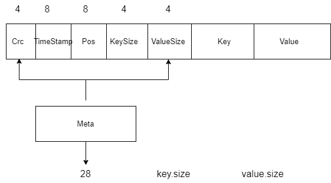

# 数据

##  数据定义

数据分为两部分组成,一部分是元数据定义,另外一部分是数据定义(key/value). 元数据中包含数据的定义信息例如 crc 校验数据的是否篡改。

## 定义长度

首先为了考虑内存对齐,对系统性能的影响。因此在声明size大小的时候 采用2的幂定义长度

```
CPU 只从对齐的地址开始加载数据（这一点可能遗漏,需要注意）
CPU 读取块的大小是固定的，通常为2的整数幂次
```

## 定义Entry



# 存储

- 根据论文,数据会分层存储,只存在一个活跃的table(write),其它都是 old table（read）。
- 并且会使用索引存储最新的数据,实现o(1)的数据查找。

## 内存索引

> 方便代码实现,使用hashmap

key: 需要查找的key
value: 存储的value以及坐标信息


定义
```golang
type indexer map[string]*DataPosition

//key存储路径
type KeyDir struct {
	Index indexer
}
```

> CRUD操作


## 磁盘存储


```golang
// 定义bitcask存储格式
type DataFiles struct {
	//存储路径
	dir string
	//已经存储文件ID
	oIds []int
	//可写入文件阈值
	segementsize int
	//活跃文件
	active  *ActiveFile
	oIdFile oldFiles
}
```

### Active Table存储

> 可读可写的文件权限

- 操作文件
- 写入文件
- 读取文件

### Old Table存储

> 修改当前文件的操作权限

> 重新生成一份新的文件

```
func rotate(){

}
```

# DB操作

不考虑任何所学的数据库,从我们的常识思考。为了保持高并发下的数据正确性，最简单的操作应该是加锁


